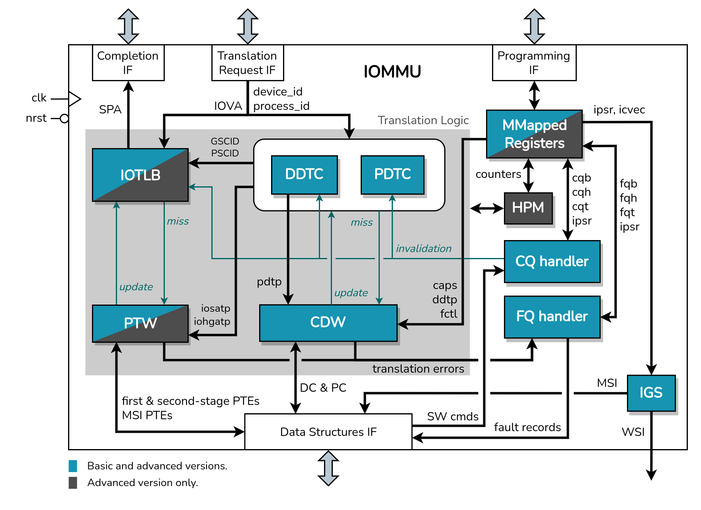
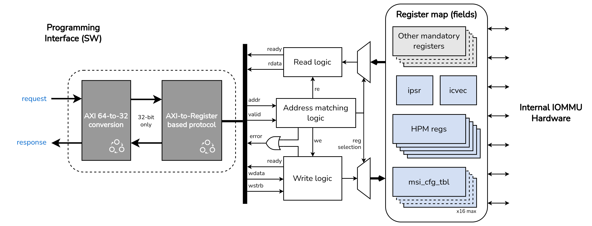
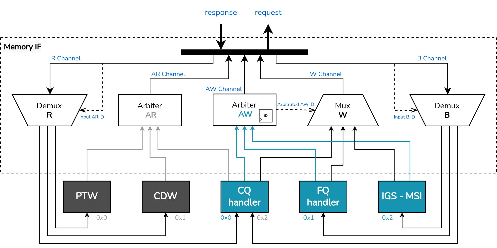
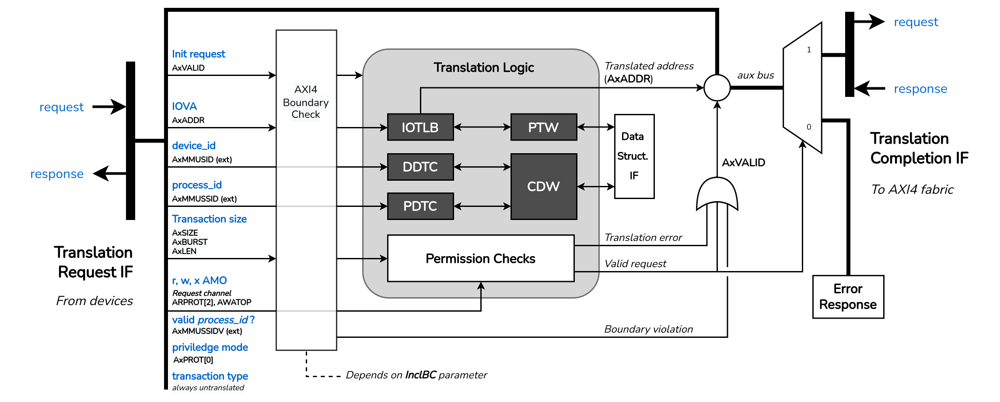

# RISC-V IOMMU
<!-- Table of contents -->
<!-- License -->
<!-- About this project -->
<!-- Interfaces -->
<!-- Usage -->
<!-- Features -->
<!-- Testing -->
<!-- Roadmap -->

## Table of Contents

- [License](#license)
- [About this Project](#about-this-project)
- [Repository Structure](#repository-structure)
- [Features](#features)
- [Interfaces](#interfaces)
- [Usage](#usage)
- [Testing](#testing)
- [Tools and versions](#tools-and-versions)
- [Roadmap and Contributions](#roadmap-and-contributions)

***

## License

This work is licensed under the Apache-2.0 License and the Solderpad Hardware License v2.1 (Apache-2.0 WITH SHL-2.1). See [LICENSE.Solerpad](./LICENSE.Solerpad) and [LICENSE.Apache](./LICENSE.Apache) files for details.

## About this Project

This repository contains the RTL implementation of an Input/Output Memory Management Unit (IOMMU), compliant with the [RISC-V IOMMU Specification](https://github.com/riscv-non-isa/riscv-iommu). An IOMMU performs permission checks, address translation and interrupt remapping on requests originated by DMA-capable IO devices.

**Disclaimer**: *This implementation is currently under development.*

A basic version of the IOMMU IP with mandatory features defined by the spec and virtualization support has been achieved and validated. However, it's still possible to find some minor bugs. The internal design of the IP is ilustrated in the diagram below. Advanced modules/features are presented in gray, and are not implemented yet.

The IOMMU IP communicates through four AXI4 interfaces, described in the [interfaces](#interfaces) section. In [features](#features), we list all features considered for both versions of the IOMMU IP (basic and advanced).

## **Repository Structure**

### **Documentation *(doc)***
In the *doc* folder you can find various diagrams and graphical resources pertaining to the internal design of the different components comprising the IOMMU IP.

### **Required SV headers *(include)***
All SystemVerilog header files required to build the IP are located in the *include* folder.

### **Required SV packages *(packages)***
All SystemVerilog packages required to build the IP are located in the *packages* folder.

### **RTL source files *(rtl)***
The *rtl* folder contains all SystemVerilog source files that make up the IP.

### **Standalone components *(vendor)***
The *vendor* folder holds SystemVerilog source files of all standalone RTL modules used in the IOMMU IP.

> Note: The *lint_checks.sv* file instantiates the **riscv_iommu** module with valid parameters to perform lint checks using verilator. Run **make** to perform these checks. Some warnings are disabled in the Makefile.

## **Features**

Our implementation does **not** include any of the PCIe features defined by the spec, and supports only little-endian memory accesses.
The following table lists all features supported by this implementation, and those that will be included in the advanced version.

| Feature  | Status |
| ------------- | ------------- |
| Memory-based Device Context (DC) indexed using *device_id* up to 24-bits | Implemented. Basic Version |
| Memory-based Process Context (PC) indexed using *process_id* up to 20-bits | Implemented. Basic Version |
| Address Translation Caches: DDT Cache, PDT Cache and IOTLB (Sv39/Sv39x4) with 16-bit *GSCID* and 20-bit *PSCID* tags (see [Spec](https://github.com/riscv-non-isa/riscv-iommu))  | Implemented. Basic Version |
| Two-stage Address Translation (Sv39/Sv39x4). Includes support for 1GiB and 2MiB superpages and support for up to three-level context directory tables | Implemented. Basic Version |
| Command Queue and Fault Queue | Implemented. Basic Version |
| MSI Translation using basic-translate mode | Implemented. Basic Version |
| WSI and MSI IOMMU interrupt generation support | Implemented. Basic Version |
| Memory-mapped register interface | Implemented. Basic Version |
| Memory-Resident Interrupt Files (MRIF) support | NOT Implemented. Advanced Version |
| Hardware Performance Monitor | Implemented. Advanced Version |
| Debug Register Interface | NOT Implemented. Advanced Version |

> Notes: PC support is parameterizable to save resources when the IOMMU is integrated into systems without this requirement. Interrupt generation support is also parameterizable. It's possible to select between WSI and MSI support, or both (at least one MUST be included). When both methods are selected, WSI generation is selected by default in the ***fctl*** register.

## **Interfaces**

Four AXI4-Full interfaces are used by the IOMMU to operate:

### **Programming Interface**

Slave interface used by RISC-V harts to program and monitor the memory-mapped registers of the IOMMU. These registers must be located within a naturally aligned 4-KiB region of physical address space.

### **Data Structures Interface**

Master interface used by modules that generate implicit memory accesses during the translation process. Arbitration logic is used to control access to this interface. The following table summarizes these modules and the data structures accessed by them. 

| Module  | Data Structures |
| ------------- | ------------- |
| Page Table Walker (PTW) | First and second-stage page tables. MSI Page Tables |
| Context Directory Walker (CDW) | Device Directory Table (DDT). Process Directory Table (PDT) |
| Command Queue handler | Command Queue |
| Fault Queue handler | Fault Queue |
| Interrupt Generation (IGS) | IOMMU-generated MSIs |

### **Translation Request Interface**

Slave interface to which DMA-capable devices connect to request address translations. A request is initiated by setting *AxVALID*. The input IO Virtual Address is taken from the AxADDR bus.

### **Translation Completion Interface**

Master interface used to forward permitted requests to the system interconnect. On a successful translation, the translated address is placed in the AxADDR bus of this interface, and the AxVALID is set to continue the transaction.

On an error, the AXI demux connects the translation request IF to the [PULP AXI Error Slave](https://github.com/openhwgroup/cva6/tree/master/vendor/pulp-platform/axi), which responds the failing request with an AXI error.

### **Wired-Signaled Interrupt wires**

The IOMMU may be configured to generate interrupts as WSIs to request service from software. These 16 wires are driven by the Interrupt Generation Support module, and should be connected to a Platform-Level Interrupt Controller (e.g. PLIC/APLIC).

## **Usage**

The top module of the IOMMU IP is located in the `riscv_iommu.sv` file. Some parameters may be used to specify the number of entries of the Address Translation Caches, the width of some signals, and internal configurations, such as whether to include support for WSI generation, support for MSI generation and support for Process Contexts.

### **Integration into a CVA6-based SoC**
TBD.\
Guidelines for integrating this IP into a CVA6-based SoC and run Linux on top of it.

## **Testing**

The IP was integrated and validated in a CVA6-based SoC, using a baremetal test framework and the [PULP iDMA](https://github.com/pulp-platform/iDMA) module as the DMA-capable device. Lint checks were performed using [verilator](https://github.com/verilator/verilator) (v4.110).

## **Tools and versions**

| Package/Tool  | Version |
| ------------- | ------------- |
| [verilator](https://github.com/verilator/verilator) | 4.110 |
| perl | 5.30.0 |
| make | 4.2.1 |
| python3 | 3.8.10 |
| autoconf | 2.69 |
| g++ | 9.4.0 |
| flex | 2.6.4 |
| ccache | 3.7.7 |
| bison | 3.5.1   |

## **Roadmap and Contributions**

As for the next steps, we plan to add support for the advanced features mentioned in the [features](#features) section. Contribution to this project is accepted in many ways:

- Improving the current design. Increasing efficiency, modularity, scalability, etc;
- Identifying errors or bugs in the implementation, through the integration and use of the IP in different systems;
- Adding support for the advanced functionalities identified in [features](#features), or any other features included in the RISC-V IOMMU specification and not included in this design.
