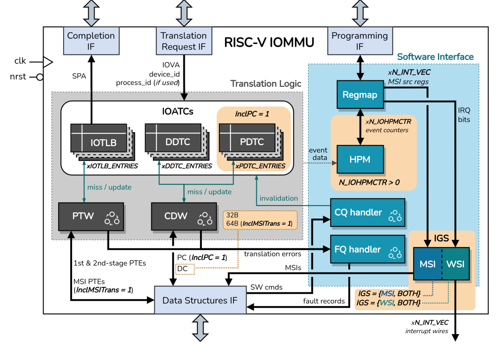
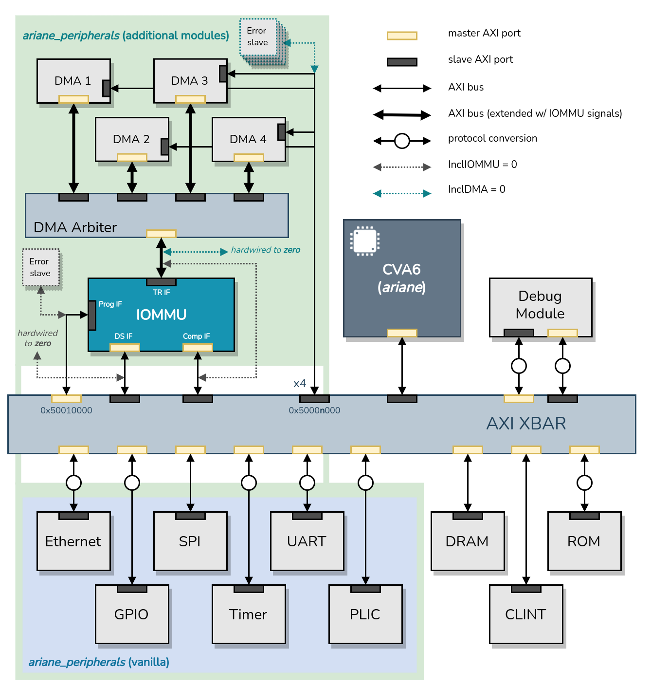

# RISC-V IOMMU

## License

This work is licensed under the Apache-2.0 License and the Solderpad Hardware License v2.1 (Apache-2.0 WITH SHL-2.1). See [LICENSE.Solerpad](./LICENSE.Solerpad) and [LICENSE.Apache](./LICENSE.Apache) files for details.

## Table of Contents

- [About this Project](#about-this-project)
- [Repository Structure](#repository-structure)
- [IOMMU Features](#iommu-features)
- [Module Parameters](#module-parameters)
- [IP Interfaces](#ip-interfaces)
- [IP Usage](#ip-usage)
    - [Integration into a CVA6-based SoC](#integration-into-a-cva6-based-soc)
    - [Functional Validation](#functional-validation)
- [Demo](#demo)
- [Tools and versions](#tools-and-versions)
- [Roadmap and Contributions](#roadmap-and-contributions)

***

## About this Project

This repository contains the SystemVerilog RTL implementation of an Input/Output Memory Management Unit (IOMMU), compliant with the [RISC-V IOMMU Specification v1.0](https://github.com/riscv-non-isa/riscv-iommu). An IOMMU performs permission checks, address translation, and interrupt remapping on requests originated by bus master devices.

:warning: **Disclaimer**: The IP is in constant development. We functionally validated the RISC-V IOMMU IP within a CVA6-based SoC with virtualization support. However, the IP is not formally verified. Thus, it is very likely to have bugs.

The microarchitecture of the IP is illustrated in the diagram below.

We classify the microarchitectural components of the IOMMU based on their functions into three primary groups:
-   **Translation Logic** modules, which play a crucial role in the address translation process, enabling access to memory to locate data structures or caching context/translation data;
-   **Software interface** modules, responsible for creating communication channels between the IOMMU hardware and software for specific purposes;
-   **External interfaces**, used by the IOMMU to interact with other hardware subsystems within the platform. The four external interfaces are described in the [interfaces](#interfaces) section.

Each module is tied to one or more architectural features and design parameters. In the [features](#features) section, we outline the architectural features included into the IP, and we identify other features defined as future work / further collaborations. In the [parameters](#parameters) section, we describe the modular parameters that affect the architecture and microarchitecture of the IP.

## **Repository Structure**

- **Documentation ([doc/](./doc/)):**
In the *doc* folder you can find various diagrams and graphical resources illustrating the internal design of the different components comprising the IOMMU IP.

- **Required SV headers ([include/](./include/)):**
SystemVerilog header files required to build the IP.

- **Required SV packages ([packages/](./packages/)):**
SystemVerilog packages used to build the IP.

- **RTL source files ([rtl/](./rtl/)):**
SystemVerilog source files that implement the IP, organized according to hardware blocks defined for the microarchitecture.

- **Standalone components ([vendor/](./vendor/)):**
The *vendor* folder holds SystemVerilog source files of all standalone RTL modules used in the IOMMU IP.

## **IOMMU Features**

Current IOMMU IP does <ins>**not**</ins> include any of the PCIe features defined by the spec, and supports only little-endian memory accesses.
The following table lists all architectural features supported by this implementation, and those that may be included in the future.

| Feature | Notes | Status |
| ------------- | ------------- | ------------- |
| Memory-based Device Context (DC) | Support for up to 3-LVL Device Directory Table walks, using 24-bits wide *device_id*. | Implemented |
| Memory-based Process Context (PC) | Support for up to 3-LVL Process Directory Table walks, using 20-bits wide *process_id*. | Implemented |
| Address Translation Caches | DDT Cache, PDT Cache (*if PC support enabled*), IOTLB, and MRIF Cache (*if MRIF support enabled*). All fully-associative. The IOTLB implements the Sv39/Sv39x4 virtual memory scheme.| Implemented |
| Two-stage Address Translation | Sv39/Sv39x4. Includes support for 1GiB and 2MiB superpages. | Implemented |
| Command Queue and Fault/Event Queue | No support for ATS commands | Implemented |
| MSI Translation | Basic-translate and MRIF modes. | Implemented |
| WSI and MSI IOMMU Interrupt Generation Support | WSI generation is selected by default in the ***fctl*** register. | Implemented |
| Memory-mapped Register Interface | Page-request Queue registers not included. | Implemented |
| Hardware Performance Monitor | Up to 31 programmable event counters. | Implemented |
| Memory-Resident Interrupt Files (MRIF) support | Atomics updates not supported. The Notice MSI is generated by the IOMMU and sent through the data structures interface. | Implemented |
| Debug Register Interface | Reuses IOMMU translation logic. Priority is given to normal transactions (external requests).| Implemented |
| PCI Express Features | Address Translation Services, Page-request Interface, returning GPAs in ATS translation, etc. | NOT Implemented |

## **Module Parameters**

In order to create an adaptable and customizable IOMMU IP, we defined a set of design parameters, as detailed in the Table below. The purpose of these parameters is to manage the inclusion of some optional features, and configure microarchitectural properties of internal IOMMU structures.

It is worth noting that, although process context support is categorized as a mandatory feature, we have designed it to be parameterizable. This design flexibility is useful to save hardware resources in scenarios where the target platform lacks support for PCs.

| Parameter | Function | Possible values |
| ------------- | ------------- | ------------- |
|***InclPC*** | Include Process Context support | 0, 1 |
|***IOTLB_ENTRIES***, ***DDTC_ENTRIES***, ***PDTC_ENTRIES*** | Define number of entries for all IOATCs | [1 - N] |
| ***MSITrans*** | Include support for MSI translation in the address translation process | MSI_DISABLED, MSI_FLAT_ONLY, MSI_FLAT_MRIF |
|***MRIFC_ENTRIES*** | Define number of entries for the MRIF Cache (only if ***MSITrans = MSI_FLAT_MRIF***) | [1 - N] |
| ***IGS*** | Define supported mechanisms for IOMMU interrupt generation | WSI_ONLY, MSI_ONLY, BOTH |
| ***N_INT_VEC*** | Define number of interrupt vectors used by the IOMMU | [1 - 16] |
| ***N_IOHPMCTR*** | Define number of event counters in the HPM | [0 - 31] |
| ***InclDBG*** | Include register-based debug interface | 0, 1 | 
| ***InclBC*** | Include 4-kiB boundary check logic for AXI4 transactions | 0, 1 |

## **IP Interfaces**

We incorporated four AXI interfaces in the IOMMU IP for system-level communication:

### **Programming Interface**

Slave interface used by RISC-V harts to program and monitor the memory-mapped registers of the IOMMU. These registers must be located within a naturally aligned 4-KiB region of physical address space.

### **Data Structures Interface**

Master interface used by modules that generate implicit memory accesses during the translation process. Arbitration and routing logic is used to control the access to this interface. The following table summarizes these modules and the data structures accessed by them. 

| Module  | Data Structures |
| ------------- | ------------- |
| Page Table Walker (PTW) | First and second-stage page tables. MSI Page Tables |
| Context Directory Walker (CDW) | Device Directory Table (DDT) & Process Directory Table (PDT) |
| Command Queue handler | Command Queue |
| Fault Queue handler | Fault Queue |
| Interrupt Generation System (IGS) - MSI | IOMMU-generated MSIs |

### **Translation Request Interface**

Slave interface to which bus master devices connect to issue DMA requests. A request is initiated by setting *AxVALID*, and the input IO Virtual Address is read from the *AxADDR* bus.

:warning: We extended this interface with IOMMU-related signals defined by the AMBA AXI specification to send additional request parameters. In particular, bus master devices coupled to the translation request port of the IOMMU **MUST** include the following signals in their master interface:

| Signal | Data transmitted |
| ------------- | ------------- |
| AxMMUSID | *device_id* |
| AxMMUSSID | *process_id* |
| AxMMUSSIDV | The transaction includes a valid *process_id* |

:information_source: Translation requests are processed individually, i.e., subsequent requests are stalled until the current one is finished.

### **Translation Completion Interface**

Master interface used to forward permitted requests to the system interconnect. On a successful translation, the translated address is placed in the *AxADDR* bus of this interface, and the *AxVALID* is set to continue the transaction. The R, W, and B AXI channels are routed from the translation request IF without modification.

On an error, the AXI demux connects the translation request IF to a [PULP AXI Error Slave](https://github.com/pulp-platform/axi/blob/master/src/axi_err_slv.sv), which responds the failing request with an AXI error.

### **Interrupt wires**

The IOMMU may be configured to generate interrupts as WSIs to request service from software. For this purpose, a set of external wires is driven by the WSI interrupt generation support module, and should be connected to a Platform-Level Interrupt Controller (e.g. PLIC/APLIC). The number of interrupt wires is defined by the N_INT_VEC parameter.

## **IP Integration and Validation**

The top module of the IOMMU IP is located in [rtl/riscv_iommu.sv](./rtl/riscv_iommu.sv). All module parameters are specified when instantiating this module.

### **Integration into a CVA6-based SoC**
We integrated the IOMMU IP into a [CVA6-based SoC](https://github.com/zero-day-labs/cva6/tree/feat/iommu) with support for the RISC-V hypervisor extension v1.0, along with a configurable number of instances of the [PULP iDMA](https://github.com/pulp-platform/iDMA) module to issue memory transfers.

The diagram below shows the target SoC after the integration of the IOMMU IP (and required iDMA instances). To connect multiple DMA devices to the translation request port of the IOMMU, we developed a DMA arbiter with a single master interface.

### **Functional Validation**

We implemented the CVA6-based SoC w/ IOMMU in a Genesys2 FPGA board using Vivado v2022.2. The IOMMU IP was functionally validated within this platform using three different software setups:

- A [framework with baremetal tests](https://github.com/zero-day-labs/riscv-iommu-tests) to validate the included architectural features.
- A Linux-based setup using the [RISC-V IOMMU Driver](https://github.com/tjeznach/linux/tree/tjeznach/riscv-iommu-aia) developed by the RISC-V IOMMU Task Group.
- A virtualization-based software stack using [Bao hypervisor](https://github.com/bao-project/bao-hypervisor) with support for the RISC-V IOMMU.

Additionally, we provide a makefile in the root of this repository to perform lint checks in the design. The *lint_checks.sv* file instantiates the **riscv_iommu** module to perform lint checks using *verilator*. Run `make` to perform these checks.

## Demo

We have developed a functional demo to illustrate the operation and advantages of the RISC-V IOMMU within two system-level setups:

- Linux with the RISC-V IOMMU driver developed by the RISC-V IOMMU Task Group.
- Bao hypervisor running a baremetal application.

You can find the source code and instructions to run the demo [here](https://github.com/zero-day-labs/riscv-iommu-demo).

## **Tools and versions**

| Package/Tool  | Version |
| ------------- | ------------- |
| [verilator](https://github.com/verilator/verilator) | 5.022 |
| perl | 5.30.0 |
| make | 4.2.1 |
| python3 | 3.8.10 |
| autoconf | 2.69 |
| g++ | 9.4.0 |
| flex | 2.6.4 |
| ccache | 3.7.7 |
| bison | 3.5.1   |

## **Roadmap and Contributions**

This IOMMU IP still has plenty room for growth and improvements. We encourage contributions in many ways (but not limited to):

- Improving the current design. Increasing efficiency, modularity, scalability, etc;
- Identifying errors or bugs in the implementation, by means of formal verification, or through the integration of the IP in other systems;
- Adding support for architectural features included in the RISC-V IOMMU specification, and not included in this design.
