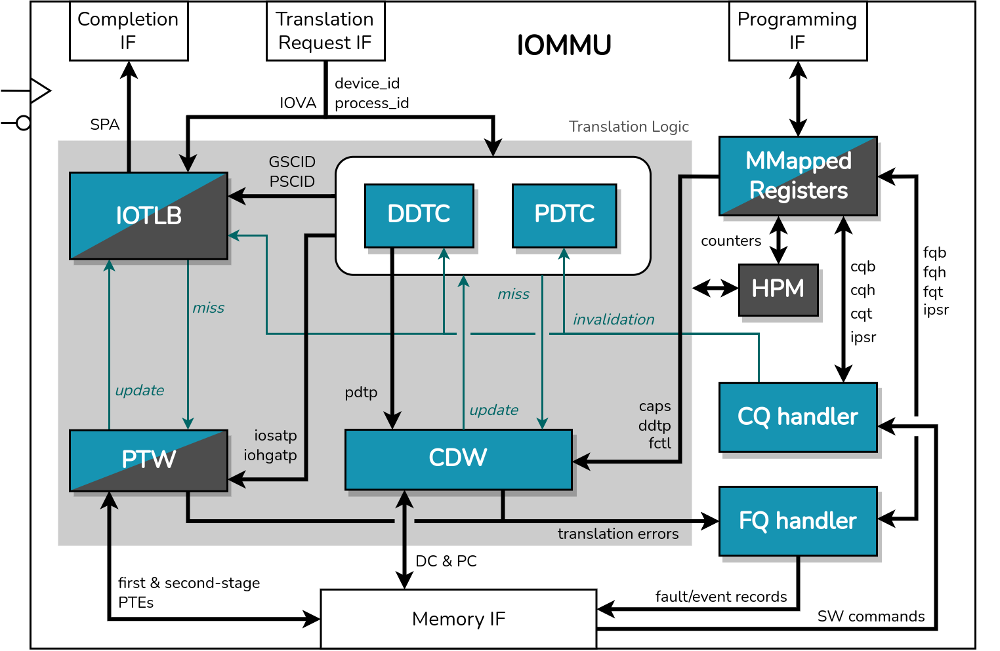
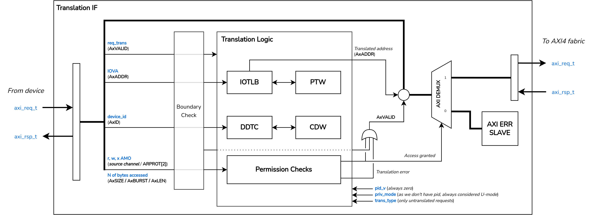

# RISC-V IOMMU
<!-- Table of contents -->
<!-- About this project -->
<!-- Interfaces -->
<!-- Usage -->
<!-- Features -->
<!-- Testing -->
<!-- Roadmap -->
<!-- License -->

## Table of Contents

- [About this Project](#about-this-project)
- [Interfaces](#interfaces)
- [Features](#features)
- [Usage](#usage)
- [Integration and Testing](#integration-and-testing)
- [Roadmap](#roadmap)
- [License](#license)

***

## About this Project

This repository contains the RTL implementation of an Input/Output Memory Management Unit (IOMMU), compliant with the [RISC-V IOMMU Specification](https://github.com/riscv-non-isa/riscv-iommu). An IOMMU performs permission checks, address translation and interrupt remapping on requests originated by DMA-capable IO devices

**This implementation is currently under development**. A basic version of the IOMMU IP with mandatory features defined by the spec and virtualization support has been achieved and validated. The internal design of the IP is ilustrated in the diagram below. Advanced modules/features are presented in gray, and are not implemented yet.

The IOMMU communicates through four AXI4 interfaces, described in the [interfaces](#interfaces) section. In [features](#features), we list all features considered for both versions of the IOMMU IP (basic and advanced).

## Interfaces

Four AXI4-Full interfaces are used by the IOMMU to operate:

- **Programming Interface**

Slave interface used by RISC-V harts to program and monitor the memory-mapped registers of the IOMMU. These registers must be located within a naturally aligned 4-KiB region of physical address space.

- **Memory Interface**

Master interface used by modules that generate implicit memory accesses during the translation process. The following table summarizes these modules and the data structures accessed by them.

| Module  | Data Structures |
| ------------- | ------------- |
| Page Table Walker (PTW) | First and second-stage page tables. MSI Page Tables |
| Context Directory Walker (CDW) | Device Directory Table (DDT). Process Directory Table (PDT) |
| Command Queue handler | Command Queue |
| Fault Queue handler | Fault Queue |
| Interrupt Generation (IGS) | IOMMU-generated MSIs |

- **Translation Request Interface**

Slave interface to which DMA-capable devices connect to request address translations. A request is initiated by setting *AXVALID*. The input IO Virtual Address is taken from the AXADDR bus.

- **Translation Completion Interface**

Master interface used to forward permitted requests to the system interconnect. On a successful translation, the translated address is placed in the AXADDR bus of this interface, and the AXVALID is set to continue the transaction.

On an error, the AXI demux connects the translation request IF to the [AXI Error Slave](https://github.com/openhwgroup/cva6/tree/master/vendor/pulp-platform/axi), which responds the failing request with an AXI error.

- **Wired-Signaled Interrupt wires**

The IOMMU may be configured to generate interrupts as WSIs to request service from software. These 16 wires are driven by the Interrupt Generation Support module, and should be connected to a Platform-Level Interrupt Controller (e.g. PLIC/APLIC).

## Features

The following table lists all features supported by this implementation, and those that will be included in the advanced version.

| Feature  | Status |
| ------------- | ------------- |
| Memory-based Device Context (DC) indexed using *device_id* up to 24-bits | Implemented. Basic Version |
| Memory-based Process Context (PC) indexed using *process_id* up to 20-bits | Implemented. Basic Version |
| Address Translation Caches: DDT Cache, PDT Cache and IOTLB with 16-bit *GSCID* and 20-bit *PSCID* tags (see [Spec](https://github.com/riscv-non-isa/riscv-iommu))  | Implemented. Basic Version |
| Two-stage Address Translation | Implemented. Basic Version |
| Command Queue and Fault Queue | Implemented. Basic Version |
| MSI Translation using basic-translate mode | Implemented. Basic Version |
| WSI and MSI IOMMU interrupt generation support | Implemented. Basic Version |
| Memory-mapped register interface | Implemented. Basic Version |
| Memory-Resident Interrupt Files (MRIF) support | NOT Implemented. Advanced Version |
| Hardware Performance Monitor | NOT Implemented. Advanced Version |
| Debug Register Interface | NOT Implemented. Advanced Version |

## Usage

The top module of the IOMMU IP is located in the `riscv_iommu.sv` file. Some parameters may be used to specify the number of entries of the Address Translation Caches, the width of some signals, and internal configurations, such as whether to include support for WSI generation, support for MSI generation and support for Process Contexts.

## Testing

The IP was integrated and validated in a CVA6-based SoC, using a baremetal test framework and the [PULP iDMA](https://github.com/pulp-platform/iDMA) module as the DMA-capable device.

## Roadmap

As for the next steps, we plan to add support for the advanced features mentioned in the [features](#features) section.

## License

TBD

